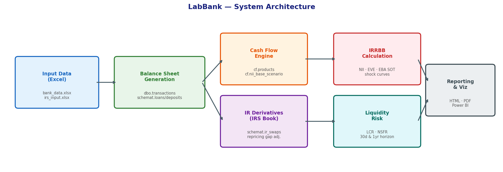
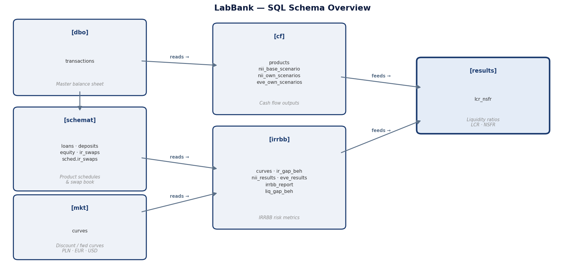
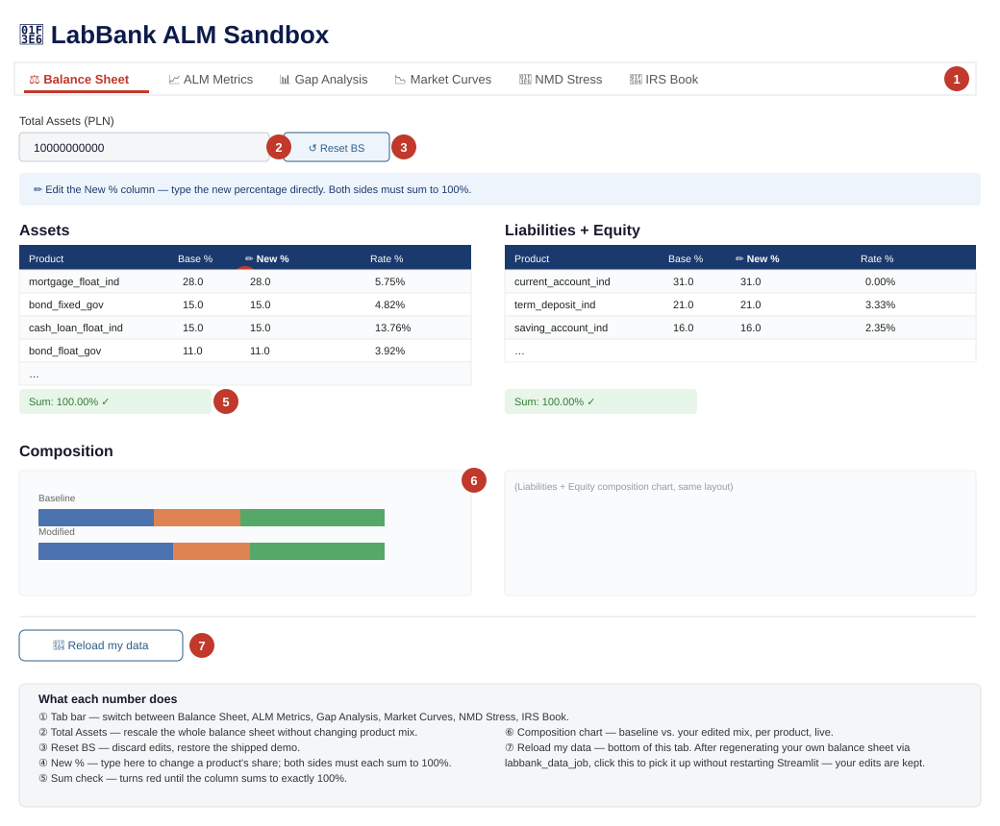

# LabBank — Methodology

A practical description of what LabBank calculates and why, written for practitioners, managers, and students — not a regulatory text, and not an academic paper. Where a formula is genuinely necessary to understand what's happening, it's included; otherwise this stays in plain language.

## The idea

A bank's balance sheet produces thousands of cash flows every day. Regulatory metrics — NII, EVE, LCR, NSFR — must all be derived from those cash flows in a consistent, auditable, reproducible way. In practice this is hard: rates reset, balances prepay, deposits decay, and shock scenarios need to be applied simultaneously across every position in every currency.

Most systems hide this complexity behind aggregated dashboards. LabBank makes it explicit, on one core principle:

> Every number in every report traces back to a single row in a single cash-flow table. No aggregation happens before it is recorded.

That means NII, EVE, LCR, and NSFR are not four separate models — they're four different aggregations of the *same* underlying cash-flow schedule.

## Measures at a glance

| Measure | Formula (one line) | Full derivation |
| --- | --- | --- |
| NII | Σ locked-interest + renewal cash flows over 1Y, per scenario | [IRRBB — NII](#irrbb--nii) |
| EVE | Σ behavioural cash flows × discount factor, run-off to maturity | [IRRBB — EVE](#irrbb--eve) |
| SOT | min(ΔEVE, 0) + 0.5 × max(ΔEVE, 0), same for NII, vs. Tier 1 | [Supervisory Outlier Test](#supervisory-outlier-test-eba-sot) |
| RWA / Tier 1 | Σ balance × rwa_weight ; Tier 1 capital / RWA | [Capital — RWA and the Tier 1 ratio](#capital--rwa-and-the-tier-1-ratio) |
| LCR | Σ HQLA × (1 − haircut) / Σ liability × outflow rate | [Liquidity — LCR and NSFR](#liquidity--lcr-and-nsfr) |
| NSFR | Σ liability × ASF / Σ asset × RSF | [Liquidity — LCR and NSFR](#liquidity--lcr-and-nsfr) |
| Repricing gap | Σ assets repricing in bucket − Σ liabilities repricing in bucket | [Repricing gap and interest rate swaps](#repricing-gap-and-interest-rate-swaps) |
| Behavioural liquidity gap | cumulative Σ (behavioural inflows − outflows) | [Behavioural liquidity gap](#behavioural-liquidity-gap) |

Every row below is derived from the same underlying cash-flow table (`cf.products`) — see [Data model](#data-model--sql-schema-reference).

## Architecture, in four layers

```
Excel inputs  →  Python modules (orchestrated by Dagster)  →  SQL Server (9 schemas)  →  Reports
```



SQL Server is the single integration bus. Every step reads from tables the previous step wrote, instead of passing hidden in-memory state — which means every stage can be re-run independently and audited by querying the database directly.

## Pipeline, step by step

1. **Balance sheet generation** — synthetic transactions are drawn from `bank_data.xlsx` using truncated-normal balance distributions and historical WIBOR rates. Written to `dbo.transactions` and five `schemat.*` tables (loans, deposits, financial instruments, equity).
2. **Market data enrichment** — yield curves bootstrapped into `mkt.curves`; historical fixings loaded into `mkt.fixings`; behavioural model parameters (prepayment, NMD decay) loaded into `bs.*`.
3. **Cash flow generation** — for every transaction, a full schedule of contractual amortisation plus behavioural adjustments is produced and written to `cf.products`. Repricing gaps are written to `irrbb.ir_gap_*`.
4. **IR derivatives (optional)** — swap legs read from `irs_input.xlsx`, cash-flow schedules written to `cf.ir_swap_*`, and the swap gap merged into `irrbb.ir_gap_beh`.
5. **IRRBB calculation** — six EBA shock scenarios applied to all curves; NII computed over a 1-year horizon, EVE as the present value of run-off cash flows. Both written to `irrbb.*`.
6. **Liquidity calculation** — LCR (HQLA vs. stressed 30-day net outflows) and NSFR (available vs. required stable funding over 1 year), written to `results.lcr_nsfr`.
7. **Reporting** — Jupyter notebooks read live from SQL and export to HTML; Excel outputs for IRRBB and LCR/NSFR.

Steps 5, 6, and 7 can each be re-run independently without touching the balance sheet or cash flows — enforced by the Dagster job definitions (`irrbb_recalc_job`, `liq_only_job`, etc).

## Data model — SQL schema reference

Nine schemas, each owned by one stage of the pipeline. Downstream stages read from upstream tables rather than sharing in-memory objects, which is what makes every stage independently re-runnable and auditable with a plain SQL client.



| Schema | Owned by | Key tables | What's in it |
| --- | --- | --- | --- |
| `dbo` | `balance_generate` | `transactions`, `equity` | The master transaction ledger — one row per synthetic client position — and the bank's equity/capital rows. |
| `schemat` | `balance_generate`, `ir_derivatives` | `loans`, `deposits`, `financial_instruments`, `equity`, `ir_swaps` | Per-product-family detail: contractual terms (rate, maturity, amortisation type, index) for every position, plus the swap book. |
| `sched` | `balance_generate` | `ir_swaps` schedules | Payment schedule scaffolding referenced by `schedule_id` from `schemat.*` and `cf.*`. |
| `mkt` | `balance_gen_add_data` | `curves`, `fixings` | Bootstrapped discount/forward curves and historical index fixings, per currency (PLN, EUR, USD). |
| `bs` | `balance_gen_add_data` | behavioural model parameters | Prepayment (CPR) and NMD decay parameters loaded from the behavioural Excel inputs. |
| `cf` | `cash_flow_calc`, `ir_derivatives` | `products`, `ir_swap_*`, `nii_base_scenario` | The core cash-flow schedule — one row per (transaction, payment date) — plus swap cash flows and per-product NII contributions. |
| `irrbb` | `irrbb_calc` | `curves`, `ir_gap_beh`, `nii_results`, `eve_results`, `irrbb_report`, `liq_gap_beh` | Shocked curves, the repricing gap (with and without the IRS overlay), and all IRRBB results. |
| `results` | `liq_calc` | `lcr_nsfr` | Final LCR/NSFR ratios and their components. |
| `opt_prep` | `optimize_prep` | product parameter / curve tensor tables | SQL mirror of the npz tensors LabBank and `bs_optimization/` read — lets you inspect the fast-approximation inputs with a SELECT instead of unpacking a numpy file. |

If you're exploring the database directly (one of the reasons this project keeps SQL Server rather than hiding it): `dbo.transactions` and `schemat.*` are the best starting point for "what does the bank actually hold," `cf.products` for "what cash flows come out of that," and `irrbb.irrbb_report` / `results.lcr_nsfr` for the final regulatory-style numbers.

### Full table reference

Every table the pipeline writes, one row each, grouped by schema and pipeline stage.

| Schema | Table | Key columns | Purpose |
| --- | --- | --- | --- |
| `dbo` | `transactions` | `transaction_id` (PK), `product_code`, `bs_side`, `balance_amt`, `currency` | Master ledger — one row per synthetic client position. |
| `dbo` | `equity` | `transaction_id`, `balance_amt` | The bank's capital / equity rows. |
| `schemat` | `loans` | `transaction_id` (FK), `rate_type`, `client_rt`, `maturity_date` | Contractual loan terms: rate, maturity, amortisation type, index. |
| `schemat` | `deposits` | `transaction_id` (FK), `rate_type`, `lcr_weight`, `asf_weight` | Deposit terms plus LCR/NSFR regulatory weights. |
| `schemat` | `financial_instruments` | `transaction_id` (FK), `hqla_class`, `haircut`, `rsf_weight` | Securities: HQLA class and RSF weight for liquidity. |
| `schemat` | `equity` | `transaction_id` (FK) | Tier 1 capital detail linked to `dbo.equity`. |
| `schemat` | `ir_swaps` | `transaction_id` (FK), `pay_fixed`, `fixed_rate`, `notional` | IRS trade book: fixed/floating leg parameters. |
| `sched` | (schedule-ID bridge tables) | `schedule_id` (PK), `product_code`, `rate_type`, `currency` | One row per unique (product, tenor, currency, rate type) group — links `schemat.*` to CF generation. |
| `mkt` | `curves` | `curve_date`, `curve_name`, `tenor`, `zero_rate`, `d_f` | Bootstrapped discount / forward curves per currency (PLN, EUR, USD). |
| `mkt` | `fixings` | `fixing_date`, `rate_index`, `tenor`, `rate` | Historical index fixings (WIBOR, EURIBOR, …). |
| `bs` | `models_loan` | `product_code`, `tenor`, `prep_rate` | Constant prepayment rate (CPR) by product and tenor bucket. |
| `bs` | `models_deposit_ir` | `product_code`, `tenor`, `outstanding` | Non-maturity deposit decay profile, IRRBB horizon. |
| `bs` | `models_deposit_liq` | `product_code`, `tenor`, `outstanding` | Same decay structure, liquidity (60M) horizon. |
| `cf` | `products` | `schedule_id` (PK), `cf_start_dt`, `fwd_rt`, `beh_outstanding`, `beh_capital_pmt`, `beh_interest_pmt` | The core cash-flow schedule — one row per (transaction, payment date), contractual and behavioural. |
| `cf` | `ir_swap_orig` / `ir_swap_beh` | same layout as `cf.products` | IRS cash-flow schedules, original and behavioural. |
| `cf` | `nii_base_scenario` | `product_code`, `client_rt`, `nii_interest`, `nii_renewal` | Per-product NII contribution before scenario aggregation. |
| `irrbb` | `ir_gap_beh` / `ir_gap_beh_a` | tenor bucket, asset/liability volume | Repricing gap — contractual, behavioural, and with the IRS overlay. |
| `irrbb` | `ir_swap_gap_beh` | tenor bucket, IRS notional | IRS-only contribution to the repricing gap. |
| `irrbb` | `shocked_curves` | `scenario`, `currency`, `tenor`, `shocked_rate` | The 6 EBA + "own" shocked curves per currency. |
| `irrbb` | `nii_results` | `scenario`, `currency`, `base_nii`, `delta_nii`, `delta_nii_pct` | NII aggregated by scenario and currency. |
| `irrbb` | `eve_results` | `scenario`, `currency`, `tenor`, `delta_pv`, `delta_eve` | EVE per scenario, currency, and tenor bucket. |
| `results` | `irrbb_report` | `scenario`, `currency`, `delta_eve_reg`, `sot_eve_pct_reg`, `delta_nii_reg`, `sot_nii_pct_reg` | Final Supervisory Outlier Test summary — ΔEVE/T1, ΔNII/T1, breach flags. |
| `results` | `lcr_nsfr` | `currency`, `hqla`, `net_outflow`, `lcr`, `asf`, `rsf`, `nsfr` | Final LCR and NSFR ratios and their components. |
| `opt_prep` | `curves_tensor` / `product_params` | vectorised, per (scenario, tenor) / per-product | SQL mirror of the `.npz` tensors the LabBank app and `bs_optimization/` read — inspect the fast-approximation inputs with a `SELECT` instead of unpacking a NumPy file. |

## Products on the balance sheet

### Available product types

Every product on the balance sheet is a row of parameters (`balance_generate/input_data/bank_data.xlsx`, sheet `bs_structure`) — the same template used for the products shipped today is what you'd copy to add a new one (credit cards, a working-capital/investment-loan split for corporates, central bank cash, etc.).

Each product type carries risk parameters — RWA weight and PD/LGD for assets; LCR outflow rate and ASF/RSF weight for liabilities and other assets. **These are illustrative values loosely inspired by the shape of real regulatory categories (Basel/CRR risk-weight bands, LCR/NSFR factor tables), not a precise regulatory calibration.** They're plain columns in an Excel file — change them for your own scenario, and there's no code to touch.

**Asset types:**

| Type | Description | Rate types available | RWA weight | PD / LGD |
| --- | --- | --- | --- | --- |
| Mortgage | Long-dated residential real estate loan to individuals, amortising | Fixed or floating | ~35% | ~1.0–1.5% / ~20% |
| Consumer / cash loan | Unsecured personal loan to individuals, shorter tenor, amortising | Fixed or floating | ~75% | ~2.0–2.5% / ~45% |
| SME investment / working-capital loan | Loan to a small/medium enterprise for capex or working capital | Floating | ~75% | ~1.5% / ~35% |
| Government bond | Sovereign debt held as a liquidity buffer / investment | Fixed or floating | 0% | ~0.5% / ~45% (HQLA Level 1, 0% haircut) |
| Treasury bill | Very short-dated (7-day) sovereign paper, the HQLA short end | Fixed | 0% | ~0.5% / ~45% (HQLA Level 1, 0% haircut) |
| Cash / central bank reserves | Overnight liquid balance at the central bank | — | 0% | — (HQLA Level 1, 0% haircut) |
| Interbank placement | Short-term money-market lending to other banks | Floating | ~20% | ~0.2% / ~45% |

**Liability & equity types:**

| Type | Description | Rate type | LCR outflow rate | ASF factor |
| --- | --- | --- | --- | --- |
| Interbank deposit | Short-term money-market borrowing from other banks | Floating | ~100% (fully runs off in stress) | ~0% |
| Current account (retail / SME) | Non-maturing transactional deposit, bank-managed ("administrative") rate | Administrative | ~5% | ~80–95% |
| Savings account | Non-maturing deposit, market-linked but bank-discretionary rate | Floating | ~10% | ~90% |
| Term deposit | Fixed-term deposit with a contracted maturity and rate | Fixed | ~5% | ~90% |
| Issued bond | The bank's own wholesale debt issuance | Floating | n/a | 100% |
| Equity (common shares, retained earnings, risk reserves) | Capital base — no contractual cash flows | — | n/a | 100% |

### The shipped demo instance

Here's exactly how those types are configured in the demo `bank_data.xlsx` today:

| Code | Product | Side | Rate type | Maturity | Amortising | Payment freq | Reset/fixing tenor |
| --- | --- | --- | --- | --- | --- | --- | --- |
| 1000 | Mortgage, fixed | Asset | Fixed | 25Y | Yes | 1M | 5Y |
| 1100 | Mortgage, floating | Asset | Variable | 30Y | Yes | 1M | 3M |
| 2000 | Consumer/cash loan, fixed | Asset | Fixed | 7Y | Yes | 1M | 7Y |
| 2100 | Consumer/cash loan, floating | Asset | Variable | 5Y | Yes | 1M | 6M |
| 4100 | Investment loan (SME), floating | Asset | Variable | 5Y | No (bullet) | 1M | 3M |
| 3000 | Government bond, fixed | Asset | Fixed | 5Y | No (bullet) | 1Y | 5Y |
| 3100 | Government bond, floating | Asset | Variable | 5Y | No (bullet) | 6M | 6M |
| 3200 | Treasury bill | Asset | Fixed | 7D | No (bullet) | 7D | — |
| 3500 | Cash / central bank reserves | Asset | Fixed | 25Y* | Yes | 1M | 5Y |
| 7900 | Interbank placement / deposit | Both | Variable | 1M | No (bullet) | 1M | 1M |
| 6000 | Current account (retail) | Liability | Administrative | Non-maturing | — | 1M | — |
| 6300 | Current account (SME) | Liability | Administrative | Non-maturing | — | 1M | — |
| 8000 | Savings account | Liability | Variable | Non-maturing | — | 1M | 2M |
| 7060 | Term deposit (retail) | Liability | Fixed | 6M | No (bullet) | 6M | — |
| 5000 | Issued bond, floating | Liability | Variable | 5Y | No (bullet) | 6M | 6M |
| 5100 / 5300 / 5400 | Common shares / retained earnings / risk reserves | Equity | — | Non-maturing | — | — | — |

*`3500` (cash) carries a 25Y "maturity" field structurally but is treated as an overnight/liquid position for LCR purposes (`hqla_class`, 0% haircut) — the field is a modelling artifact of reusing the same product template, not an actual term.

Other columns on each row that matter downstream: **`rate_index`/`disc_curve`/`fwd_curve`** (which market curve prices and discounts the product), **`dc_conv`/`b_day_conv`** (day-count and business-day convention for schedule generation), **`rwa_weight`/`PD`/`LGD`** (capital/credit-risk parameters, used by `bs_optimization/`, not by the core IRRBB/liquidity engine), **`hqla_class`/`haircut`** and **`ASF`/`RSF`** (LCR and NSFR weights), and **`vol_elasticity`/`fee_unit_rate`/`acq_cost_rate`** (optimizer-only fields — see the technical notes for why LabBank currently pulls these in even though it doesn't use them).

7900 (interbank placement/deposit) is the one product code used on **both** sides of the balance sheet — an asset row (money placed with other banks) and a liability row (money borrowed from other banks) — distinguished by the `bs_side` column, not the product code.

## Cash flow engine and behavioural modelling

For each product, the engine generates two things per period: **capital cash flows** (contractual amortisation plus behavioural adjustments) and **interest cash flows** (coupon payments at the contracted client rate).

Behavioural assumptions applied:

- **Loans** — a prepayment rate (CPR) applied monthly to the outstanding balance. This is **not a single fixed number for the whole book**: it's set per (product, tenor bucket) in `loan_beh_models.xlsx`, reloaded every time the pipeline runs — so editing that Excel file changes prepayment behaviour for the products/tenors you touch, without any code change. What it does *not* do is respond to the rate shock itself: for a given loan, the CPR value is held constant for the life of that loan and is the same across every EBA scenario — a par-down shock gets the same prepayment cash flows as a par-up shock. That's a standard simplification, but it means negative convexity (prepayment speeding up when rates fall) isn't modelled — see the technical notes if you're evaluating how much that matters for your use case.
- **Non-maturity deposits (NMD)** — an exponential decay model: a fraction leaves each month, the remainder is treated as sticky long-term funding.
- **Rate floors and caps** — each product can have a `client_floor`/`client_cap` set in `interest_rt.xlsx`, applied to both the shocked client rate and the renewal rate for capital maturing within the NII horizon. In the shipped demo data, the deposit-type products — current accounts (administrative rate, hardcoded to 0% regardless of scenario), savings accounts, and term deposits — all have `client_floor = 0.0`, so a downward shock can't push what the bank pays depositors below zero. Loan-type products have no floor/cap set by default. This is per-product and data-driven, not a blanket rule, so if you add a new deposit-like product, remember to set its floor explicitly if you want the same protection.

The key output table, `cf.products`, has one row per (transaction, payment date), including both the contractual and behavioural outstanding balance and cash flow, the market forward rate, and the all-in client rate. NII is computed from the interest cash flows within the 1-year horizon; EVE uses the full behavioural run-off schedule to maturity.

## Repricing gap and interest rate swaps

The **repricing gap** is the net volume of assets minus liabilities repricing in each tenor bucket:

```
Gap_bucket = Σ (asset balances repricing in that bucket) − Σ (liability balances repricing in that bucket)
```

A positive gap means more assets reprice in that bucket — the bank benefits from rising rates there; a negative gap signals liability-sensitive exposure.

Interest rate swaps overlay this gap **without changing the underlying balance sheet**: the swap gap is computed separately and merged into the balance-sheet repricing gap before IRRBB is calculated. This is what lets LabBank show "balance sheet only" vs. "balance sheet + IRS" gap views side by side.

### How a swap is set up

Swaps are defined in `ir_derivatives/input/irs_input.xlsx`, one row per trade:

| Column | Meaning |
| --- | --- |
| `swap_id` | Trade identifier |
| `pay_fixed` | `0` = bank **receives fixed, pays floating**; `1` = bank **pays fixed, receives floating** |
| `notional` | Trade notional (PLN) |
| `start_date` / `maturity_date` | Trade dates |
| `fixed_rate`, `fixed_pay_freq`, `fixed_dc_conv` | Fixed leg: rate, payment frequency (e.g. annual), day-count convention |
| `float_rate_index`, `float_pay_freq`, `float_fixing_freq`, `float_spread` | Float leg: reference index (e.g. `PLN_ASK_3M`), payment/reset frequency, spread over the index |
| `disc_curve` / `fwd_curve` | Which curves discount and forward-project this trade |

The shipped demo book is 12 receive-fixed swaps (`pay_fixed=0`), 4.5% fixed rate, notionals of 40-50M PLN each, staggered monthly starts across 2025-2026, against 3M or 6M WIBOR — a textbook hedge for a floating-rate loan book: the bank pays WIBOR on the swap to offset WIBOR received from borrowers, keeping the fixed spread.

### How a swap is valued

Both legs are cash-flow-projected on the same monthly curve grid as the rest of the balance sheet:

- **Fixed leg** — accrues at `fixed_rate` on its own payment frequency (annual by default).
- **Floating leg** — reprices every `float_fixing_freq` (e.g. every 3 months), each period's rate taken as the forward rate implied by the discount curve between that period's start and end.

**NII contribution** — accrual basis (not discounted) over the 1-year horizon: `notional × fixed_rate × min(horizon, remaining term)` on the fixed side, netted against the sum of the floating leg's per-period forward-rate accruals over the same window, signed `+1` for receive-fixed / `-1` for pay-fixed.

**EVE contribution** — present value of all remaining net cash flows (fixed leg minus floating leg, or vice versa) on both legs to maturity, discounted on the trade's `disc_curve`.

**Repricing gap contribution** — each swap's floating leg is placed into the gap ladder at its *next* fixing date (`start_date` + `float_fixing_freq`, rolled forward), not at trade maturity — that's what makes it show up as a near-term repricing item even for a multi-year swap.

## IRRBB — NII

NII decomposes into two parts per scenario, computed per cash flow and summed over the 1-year horizon:

```
NII_scenario = Σ_cf [ outstanding_balance × client_rate_shocked × year_fraction × sign ]      (locked interest)
             + Σ_cf [ (capital_repaid + prepaid) × renewal_rate_shocked × remaining_year_fraction × sign ]   (renewal)

sign = +1 for assets, −1 for liabilities
```

- **Locked interest** — income from cash flows already contracted (rate and notional fixed). Fixed-rate products keep their contracted rate here; floating-rate products re-price at the shocked curve using a stable-margin transform (`client_rate = base_rate + a × (shocked_index − base_index)`, so the origination spread is preserved). Administrative-rate products (current accounts) are fixed at 0% regardless of scenario.
- **Renewal** — income from capital maturing (or prepaying) within the 1-year horizon, reinvested/re-borrowed at the *shocked market rate* — this applies even to fixed-rate products, since a maturing fixed-rate deposit or loan renews at whatever the new environment offers, not its old contracted rate. Both the locked and renewal rates are subject to each product's `client_floor`/`client_cap` (see Rate floors and caps above).

A bank with more assets than liabilities repricing in the short end is **asset-sensitive**: parallel-up shocks help NII, parallel-down shocks hurt it.

## IRRBB — EVE

EVE is the present value of all future cash flows under a **run-off assumption** — no new business, the existing book winds down to maturity:

```
EVE = Σᵢ CFᵢ_behavioural × discount_factor(tᵢ)
ΔEVE_scenario = EVE_scenario − EVE_base
```

Because EVE uses all maturities (not a 1-year cut-off), it's the slower calculation of the two. A negative ΔEVE means economic net worth falls under that scenario — typically because long fixed-rate assets lose value faster than liabilities as rates rise. This is what creates the classic NII-vs-EVE trade-off: a bank positioned to benefit from rising rates on NII is usually the same bank that loses EVE in that scenario.

## EBA shock scenario construction

Six supervisory scenarios (per EBA/RTS/2022/10) are applied to each currency curve — parallel up/down, steepener, flattener, and short-rate up/down — plus an "own" scenario. Shocks are floored at 0% per tenor (rates can't be shocked below zero in this construction). Example PLN parameters: parallel shock ±250 bps, short-rate ±350 bps, long-rate ±150 bps; the "own" scenario adds a −100 bps parallel shock.

## Supervisory Outlier Test (EBA SOT)

The SOT applies a **50% haircut** to a scenario's ΔEVE if it comes out as a *gain*, before it counts toward the regulatory total:

```
ΔEVE_regulatory = min(ΔEVE, 0) + 0.5 × max(ΔEVE, 0)
```

The same logic is applied to the NII SOT.

Thresholds:

- **EVE SOT**: ΔEVE_regulatory / Tier 1 capital < −15% → breach.
- **NII SOT**: ΔNII_regulatory / Tier 1 capital < −5% → breach.

## Capital — RWA and the Tier 1 ratio

```
RWA             = Σᵢ balanceᵢ × rwa_weightᵢ                (assets only)
Tier 1 / RWA    = Tier 1 capital / RWA                       ≥ configurable minimum
```

Tier 1 capital is read directly off the equity side of the balance sheet (`schemat.equity` / `dbo.equity`). `rwa_weight` is a per-product column in `bs_structure` (illustrative Basel/CRR-inspired risk-weight bands — see the product tables above; ~0% for sovereigns/cash, ~35% for mortgages, ~75% for unsecured/SME lending). LabBank's Metrics tab shows this ratio next to the EVE/NII SOT results, against a configurable minimum threshold.

## Liquidity — LCR and NSFR

```
LCR  = HQLA / stressed net outflows (30 days)                          ≥ 100%
     = Σᵢ balanceᵢ × (1 − haircutᵢ)              [HQLA-eligible assets]
       ─────────────────────────────────────
       Σⱼ balanceⱼ × lcr_outflow_rateⱼ            [liabilities, 30-day stress]

NSFR = Available Stable Funding / Required Stable Funding              ≥ 100%
     = Σⱼ balanceⱼ × ASFⱼ                          [liabilities & equity]
       ────────────────────
       Σᵢ balanceᵢ × RSFᵢ                          [assets]
```

- **HQLA** — Level 1 liquid assets (cash, central bank reserves, sovereign bonds, T-bills) at their respective haircuts (`haircut`/`hqla_class` columns in `bs_structure` — 0% haircut for all Level 1 assets in the shipped demo data).
- **Net outflows** — each liability's balance weighted by its `LCR` outflow rate (e.g. ~5% for sticky retail current accounts vs. ~100% for wholesale interbank funding) — stressed deposit run-off and interbank maturities within 30 days.
- **ASF** — each liability/equity balance weighted by its `ASF` factor — tenor- and type-dependent, equity and long-term debt score highest (100%).
- **RSF** — each asset balance weighted by its `RSF` factor — illiquidity-dependent, loans score highest, HQLA scores lowest (e.g. ~5%).

## Behavioural liquidity gap

Beyond the regulatory ratios, the liquidity gap shows the net cash position across the full tenor ladder (up to 60 months), using behavioural cash flows — loan prepayments included, NMD decay applied:

```
Cumulative gap_t = Σ_{k ≤ t} (behavioural inflows_k − behavioural outflows_k)
```

A sustained negative cumulative gap identifies the point at which the bank would need additional funding — the primary input for contingency funding planning, distinct from the point-in-time LCR/NSFR ratios.

## Exploring this interactively — LabBank

The Streamlit app (`sandbox/app.py`) lets you stress every piece described above without touching SQL. See the [setup guide](01_setup_guide.md) to run it — this section is a tour of what each tab does.

The six tabs, in the order they appear in the app: **Balance Sheet · ALM Metrics · Gap Analysis · Market Curves · NMD Stress · IRS Book**. You edit the balance sheet (and, optionally, the swap book and the NMD decay profiles), and the results tabs react.

### ⚖️ Balance Sheet

The tab you land on. Edit the balance sheet mix and immediately see the composition change; every other tab reacts to whatever you set here.



### 📈 ALM Metrics

The results dashboard: NII, EVE, LCR, and NSFR, baseline vs. modified, plus RWA and the Tier 1/RWA ratio against a configurable minimum. Below that: the EBA Supervisory Outlier Test (ΔEVE/T1 and ΔNII/T1 against the −15%/−5% thresholds, pass/fail called out explicitly), then per-scenario ΔNII and ΔEVE bar charts, an IRS contribution breakdown, a full scenario table, and an LCR/NSFR diagnostic that flags if you've zeroed out all HQLA-eligible assets.

### 📊 Gap Analysis

Three repricing-gap panels — assets vs. liabilities repricing per bucket with the IRS overlay shown separately, net gap with and without IRS side by side, and the cumulative net gap — followed by the 12-month behavioural liquidity gap (principal inflows vs. outflows per month, and the cumulative net position).

### 📉 Market Curves

The base forward/zero curve per currency, the full set of EBA shock scenario curves overlaid, and a "hypothetical scenarios" panel where you pick a stylised curve shape (normal, steep, humped, flat, inverted) and rate level (current, −300 bp, +150 bp) to see the ALM Metrics tab recompute for a rate environment that isn't one of the 7 EBA scenarios.

For each of the 15 stylised curves, `sandbox/build_scenario_curves.py` pre-computes the **exact** per-product NII and EVE — base plus all 7 EBA shocks *on top of that hypothetical base* — by re-pricing the existing run-off / 12-month cash-flow streams with the same functions the production `irrbb_calc` pipeline uses (no cash-flow regeneration). The results land in `sandbox/scenario_curves.npz`; the app reads them and scales to the edited balance sheet, so a low-rate hypothetical curve correctly shows, for example, the 0% post-shock floor collapsing the down-shock ΔNII. If that npz is missing or stale (product-cohort set changed), the app falls back to a lighter analytical approximation and says so in a caption.

### 🏦 NMD Stress

Pick a non-maturity deposit product (current account or savings account) and edit its **outstanding-percentage decay profile** directly — how much of the balance is assumed to still be on the books at each future tenor. A chart compares your stressed profile against the baseline. An "advanced" expander lets you set a renewal rate for capital that runs off within the horizon. Changes here flow into both the ALM Metrics and Gap Analysis tabs as an additive ΔNII/ΔEVE overlay.

### 🔄 IRS Book

Edit the interest rate swap book: add/remove trades, change notional or fixed rate, toggle `pay_fixed` per swap (same convention as `irs_input.xlsx` — see the IRS section above). A leg summary table shows net receive-fixed vs. pay-fixed notional and the weighted-average fixed rate on each side, baseline vs. your edits.

## What's next — balance sheet optimisation

Balance sheet optimisation (constrained economic-profit vs. ΔEVE/ΔNII breach trade-off) is the next phase, implemented as four solvers (deterministic, joint balance-sheet + swap overlay, stochastic Monte Carlo, and a natural-hedge minimiser). It's functional and fairly mature, but it lives in `bs_optimization/`, which is a **private git submodule** (`LabBank-Optimization`) — not part of this public repository. It's also not yet part of the guided LabBank path; treat it as a preview of where this project is heading rather than a finished, documented feature.

## A note on scope

Behavioural models (prepayment, NMD decay) are illustrative rather than calibrated to a real portfolio, and the balance sheet itself is synthetic. This project demonstrates *how* an ALM pipeline should be built and how its metrics relate to each other — it is not a substitute for a validated, governed production risk system.
